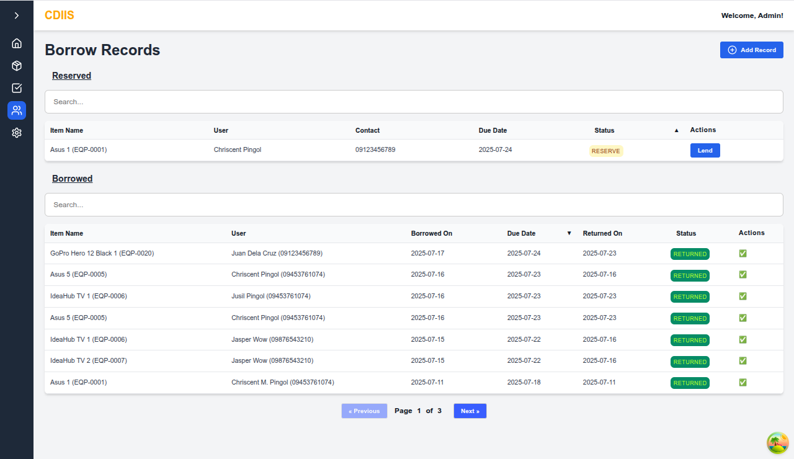

# CDIIS Online Inventory System

## Table of Contents

- [Overview](#overview)
- [Getting Started](#getting-started)
- [Project Status](#project-status)
- [Vision](#vision)
- [Key Features (Planned)](#key-features-planned)
- [Technologies (Planned)](#technologies-planned)
- [Support](#support)
- [License](#license)

## Overview

Welcome to the GitHub repository for the **CDIIS Online Inventory System**! This project aims to develop a robust and user-friendly web-based platform for managing inventory efficiently. The system will provide tools for tracking and managing equipment information and handling incoming and outgoing items.

## Getting Started

As this is an initial commit, there are no setup instructions yet. Once development begins, this section will be updated with:

* Prerequisites
* Installation steps
* Configuration details
* How to run the application

## Dashboard

The dashboard lists the details of the statuses of each item wether it is borrowed, reserved, and/or in attendance.

## Inventory

The registered items inside the database wil be found here. Here you can add, edit, and delete items from the inventory. The QR Codes of each item will be found when you create or edit the item.

## Item Attendance

Each item can be checked **twice daily**. Once in the **morning** and once in the **afternoon**. You can check the components to ensure each item pack is not lost. 

An **(optional)** feedback box is for additional contexts about the item. 

## Records

The **status** of each item is recorded here. Reserved items and Borrowed items are each on its own table. Each column has a sort feature of ascending and descending.

#### Status:
- Reserved
- Cancelled
- Borrowed
- Returned

## Key Features

While still in the planning stages, the CDIIS Online Inventory System is envisioned to include the following core functionalities:

- [x] **User Authentication & Authorization:** Secure login and role-based access control.
- [x] **Product Management:** Add, edit, delete, and view product details (SKU, name, description, price, etc.).
- [x] **Inbound/Outbound Transactions:** Record and manage incoming (e.g., borrowers) and outgoing (e.g., lenders) inventory movements.
- [x] **Search & Filtering:** Efficiently search and filter inventory data.
- [x] **Dashboard:** An overview of key inventory metrics.

## Technologies

The specific technologies to be used will be determined during the design phase. However, we anticipate using a modern web development stack. Potential technologies may include:

* **Frontend:** HTML, CSS, JavaScript (MERN Stack)
* **Backend:** Node.js (Express)
* **Database:** MongoDB
* **Deployment:** Vercel

## Vision

The vision of the CDIIS Online Inventory System is to bring the organization's inventory management into the digital age. By transitioning from offline, manual tracking to a centralized online system, we aim to improve **visibility, accessibility,** and **accuracy** for both members and administrators. 

This platform empowers users to view, manage, and monitor equipment status in real time — reducing human error, eliminating lost paperwork, and making collaboration across departments easier and more transparent.

Digitizing the inventory ensures that updates are instantly reflected, historical data is preserved, and everyone involved can stay informed anytime, anywhere — all through a simple and user-friendly interface.

## Support

For any inquiries or support, please open an issue in the GitHub repository.

## License

This project is under the **[MIT License](./LICENSE)**.